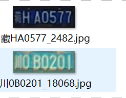

# 车牌识别

**车牌检测 看这里[车牌检测](https://github.com/edgehook/license_plate_detect.git)**

训练的时候 选择相应的cfg 即可选择模型的大小

train.py

```
 # construct face related neural networks
    #cfg =[8,8,16,16,'M',32,32,'M',48,48,'M',64,128] #small model
    # cfg =[16,16,32,32,'M',64,64,'M',96,96,'M',128,256]#medium model
    cfg =[32,32,64,64,'M',128,128,'M',196,196,'M',256,256] #big model
    model = myNet_ocr(num_classes=len(plate_chr),cfg=cfg)
```

## 环境配置

1. Jetson AGX Orin  Ubuntu 20.04
2. **PyTorch > 1.2.0
3. yaml
4. easydict
5. tensorboardX

## 数据

#### 车牌识别数据集CCPD+CRPD

1. 数据集打上标签,生成train.txt和val.txt

   

   图片命名如上图：**车牌号_序号.jpg**
   然后执行如下命令，得到train.txt和val.txt

   ```
   python plateLabel.py --image_path your/train/img/path/ --label_file datasets/train.txt
   python plateLabel.py --image_path your/val/img/path/ --label_file datasets/val.txt
   ```

   数据格式如下：

   train.txt

   ```
   /CCPD/冀BAJ731_3.jpg 5 53 52 60 49 45 43 
   /CCPD/冀BD387U_2454.jpg 5 53 55 45 50 49 70 
   /CCPD/冀BG150C_3.jpg 5 53 58 43 47 42 54 
   /CCPD/皖A656V3_8090.jpg 13 52 48 47 48 71 45 
   ```
3. 将train.txt  val.txt路径写入lib/config/360CC_config.yaml 中

   ```
   DATASET:
     DATASET: 360CC
     ROOT: ""
     CHAR_FILE: 'lib/dataset/txt/plate2.txt'
     JSON_FILE: {'train': 'datasets/train.txt', 'val': 'datasets/val.txt'}
   ```

## Train

```
python train.py --cfg lib/config/360CC_config.yaml
```

结果保存再output文件夹中

## 测试demo

```

python demo.py --model_path saved_model/best.pth --image_path images/test.jpg
                                   or your/model/path
```

## 导出onnx

```
python export.py --weights saved_model/best.pth --save_path saved_model/best.onnx  --simplify

```


#### onnx 推理

```
python onnx_infer.py --onnx_file saved_model/best.onnx  --image_path images/test.jpg

```

